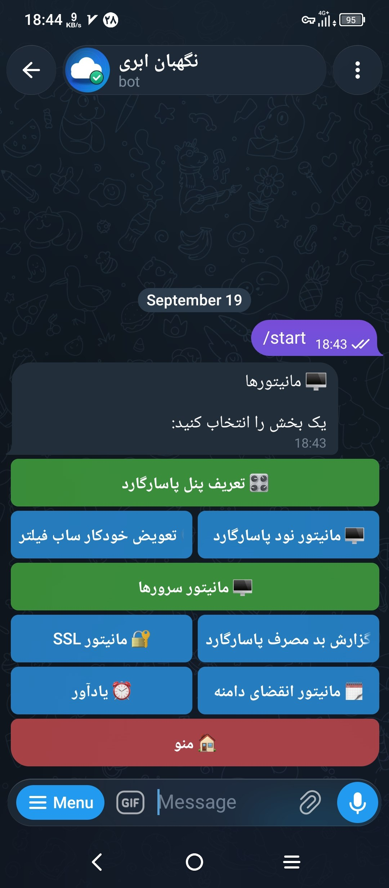
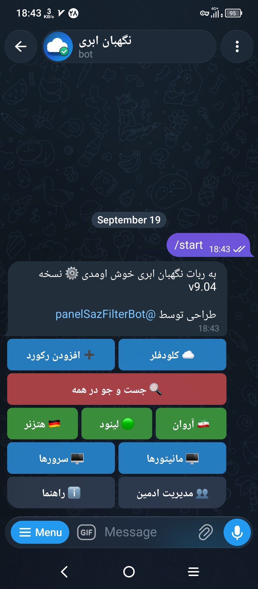
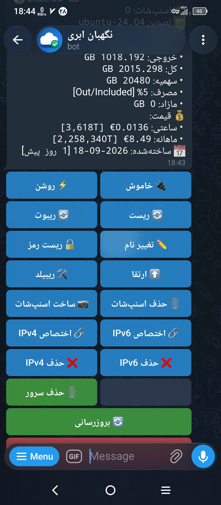

# نگهبان ابری ☁️

مدیریت کامل **دامنه، DNS، پنل پاسارگارد و سرورها (هتزنر، لینود، آروان)** در تلگرام — روی **Cloudflare Workers** اجرا میشود؛ بدون هیچ سروری برای اجرا (فقط یک سرور برای نصب لازم است).

---
<p align="center">
  
  
  
</p>

## خلاصه

ربات تلگرامی مدیریت **دامنه، DNS، پنل پاسارگارد و سرورها** که کامل روی **Cloudflare Workers** اجرا می‌شود.

`☁️ کلودفلر` · `🇩🇪 هتزنر` · `🟢 لینود` · `🇮🇷 آروان` · `✨ فیچرهای جدید`

### دکمه‌های عملیاتی

```text
🏠 منوی اصلی
├── ➕ افزودن رکورد · ☁️ کلودفلر ── دامنه‌ها ── رکوردها (ویرایش/حذف · SSL · Proxy · TTL)
├── 🔍 جست و جو در همه ── ⭐ ساب‌های منتخب · 🗂 عملیات گروهی
├── 🇩🇪 هتزنر · 🟢 لینود · 🇮🇷 آروان ── ساخت/حذف سرور · اسنپ‌شات · آی‌پی
├── 🖥 سرورها ── نصب/آپدیت نود پاسارگارد · مانیتور
├── ✨ فیچرهای جدید
│   ├── 🎛 پنل پاسارگارد · 🧭 تعویض خودکار ساب فیلتر · 📡 مانیتور نود
│   ├── 🖥 مانیتور سرورها · 🔥 گزارش بدمصرف
│   ├── 🔐 مانیتور SSL · ☁️ سهمیه کلادفلر
│   ├── ⏰ یادآورها · 🗓 انقضای دامنه
│   ├── 📊 ترافیک ساب‌ها · ⚖️ لود بالانسر IP
│   └── ✉️ ایمیل سازمانی + 📩 فوروارد
└── ⚙️ تنظیمات و راهنما ── 👥 ادمین‌ها · 📊 آمار نصب‌ها (فهرست اعضا + مشخصات + پیام به کاربر) · 📢 پیام همگانی
```

<details>
<summary align="right" dir="rtl"><b>بیشتر</b></summary>

<div align="right" dir="rtl">
<b>🏠 منوی اصلی</b><br>
🔍 جست‌وجو در همه · ⭐ ساب‌های منتخب · ☁️ کلودفلر · 🏢 دیتاسنترها (هتزنر، لینود و آروان) · 🗂 عملیات گروهی · ➕ افزودن رکورد · ✨ فیچرهای جدید · ℹ️ راهنما · 👥 مدیریت ادمین<br><br>

<b>☁️ کلودفلر</b><br>
➕ افزودن اکانت کلودفلر · ➕ افزودن دامنه جدید · ➕ افزودن رکورد · ✏️ تغییر مقدار · ✏️ تغییر نام · ⏱ تغییر TTL · 🔄 تغییر Proxy · 🔄 تغییر نوع · 🔒 SSL/TLS · ⚡ جای‌گذاری سریع · 🗂 عملیات گروهی · ⭐ افزودن به منتخب‌ها · 🗑 حذف رکورد · 🗑 حذف دامنه · 🗑 حذف اکانت<br><br>

<b>🇩🇪 هتزنر / 🟢 لینود — مدیریت کامل سرور</b><br>
➕ ساخت سرور · ⚡ روشن · 🔌 خاموش · 🔄 ریبوت · 🛠️ ریبیلد · ⬆️ ارتقا · 🔓 ریست رمز · ✏️ تغییر نام · 🗑 حذف سرور<br>
📷 اسنپ‌شات · 📸 اسنپ‌شات‌ها · ✏️ تغییر نام · 🗑 حذف<br>
🌐 آی‌پی‌های اصلی · ➕ ساخت IPv4 · ➕ ساخت IPv6 · 🔗 اختصاص به سرور · ❌ حذف اختصاص · ✏️ تغییر PTR · 🗑 حذف آی‌پی<br>
➕ افزودن اکانت هتزنر/لینود · ⚙️ تنظیمات اکانت · 🗑 حذف اکانت<br><br>

<b>🇮🇷 آروان — دامنه و سرور ابری</b><br>
🌐 دامنه‌ها · 📋 رکوردها · ✏️ تغییر مقدار (تعویض IP) · ☁️ روشن/خاموش ابری · ➕ افزودن رکورد · 🗑 حذف رکورد · 🔍 جست‌وجو و ⭐ منتخب‌ها<br>
🛡 امنیت دامنه: 🧱 قوانین فایروال · 🛡 WAF · 🔒 SSL · 📊 ترافیک<br>
🖥 سرورها (به‌تفکیک ریجن) · ➕ ساخت سرور (نام، ایمیج، پلن، شبکه، کلید SSH) · ⚡ روشن · 🔌 خاموش · 🔄 ریبوت · ⬆️ تغییر سایز · 🛠️ ریبیلد · 📷 اسنپ‌شات · ✏️ تغییرنام · 🔑 ریست رمز root · 🗑 حذف سرور<br>
🌐 آی‌پی شناور (ساخت/اتصال/جدا/حذف) · 💾 دیسک (ساخت/اتصال/جدا/حذف)<br>
➕ افزودن اکانت (کلید ماشین‌یوزر) · 🗑 حذف اکانت<br><br>

<b>✨ فیچرهای جدید</b><br>
🧭 تعویض خودکار هاست فیلتر (مانیتور فیلتر شدن ساب) — وقتی دامنهٔ هاست پاسارگارد در ایران فیلتر شود، دامنهٔ شماره‌دار جدیدی برای همان آی‌پی ساخته و جایگزین می‌کند.<br>
🖥 مانیتور نود پاسارگارد — هشدار قطع/وصل نود (رویدادمحور) + 🔗 وب‌هوک + 🔄 همگام‌سازی با پنل + ⏰ ایجاد یادآور انقضا سرور<br>
🔐 مانیتور SSL — هشدار نزدیک شدن انقضای گواهی<br>
✉️ ایمیل‌ها — وصل چند دامنه با یک دکمه و دیدن متن ایمیل‌ها در صندوق ورودی تلگرام<br>
⏰ یادآور — ➕ یادآور جدید · 🗑 حذف یادآور · ⚙️ تنظیمات یادآور<br><br>

<b>🗂 عملیات گروهی و جست‌وجو</b><br>
🗂 گروهی (حذف گروهی / تغییر مقدار / تغییر نوع / افزودن به منتخب‌ها) · 🔍 جست‌وجو · 🔤 بر اساس نام/دامنه · 🌐 بر اساس IP/مقدار<br><br>

<b>👥 مدیریت ادمین</b><br>
➕ افزودن ادمین · 🗑 حذف ادمین · 💾 بکاپ
</div>
</details>

---
## پیشنیازها

| # | پیشنیاز | راهنما |
|---|---|---|
| ۱ | توکن API کلادفلر | [ساخت توکن](https://dash.cloudflare.com/profile/api-tokens) · [آموزش متنی](docs/cloudflare-api-token.md) |
| ۲ | توکن ربات تلگرام | از [@BotFather](https://t.me/BotFather) با دستور `/newbot` |
| ۳ | شناسهٔ عددی تلگرام خودتان (برای مدیر) | از [@userinfobot](https://t.me/userinfobot) |

**توکن کلادفلر — فقط ۱ بار تیک بزن:**

> برای ساخت توکن به [راهنمای بدون عکس](docs/TOKEN_GUIDE.md) مراجعه کن — فقط همین ۸ تا رو تیک بزن و `cfut_...` رو کپی کن.

۱. برو: https://dash.cloudflare.com/profile/api-tokens → Create Custom Token
۲. [۱۰ مجوز](docs/TOKEN_GUIDE.md) رو تیک بزن
۳. Continue → Create Token → توکن رو به اسکریپت بده

> بقیه مجوزها خودکار ساخته میشه.

---
## نصب (از طریق سرور روی کلادفلر)
روی سرور موقت لینوکسی اجرا کنید:

```bash
bash -c "$(curl -sL https://raw.githubusercontent.com/Aknuun/cloud-guardian/main/install.sh)"
```

> سرور فقط «ابزار نصب» است. بعد از نصب میتوانید آن را حذف کنید؛ ربات مستقل کار میکند.

---
ساخته شده با ❤️ برای کسانی که کار روزمرهٔ مدیریت دامنه و سرور را به تلگرام سپردهاند.
