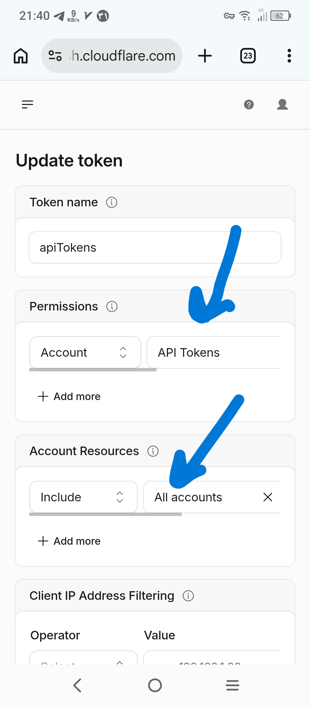

# ساخت توکن کلادفلر — فقط ۱ مجوز

۱. برو: https://dash.cloudflare.com/profile/api-tokens → `Create Custom Token`
۲. فعال کن: `Account → API Tokens → Edit` (Account Resources = All accounts)
۳. `Continue → Create Token` → توکن `cfut_...` رو کپی کن به اسکریپت بده

<p align="center">
  
</p>

> بقیه 10 مجوز خودکار ساخته میشه. این توکن بعد نصب قابل حذفه.

```bash
curl -s -H "Authorization: Bearer cfut_..." https://api.cloudflare.com/client/v4/user/tokens/verify
# success: true
```
