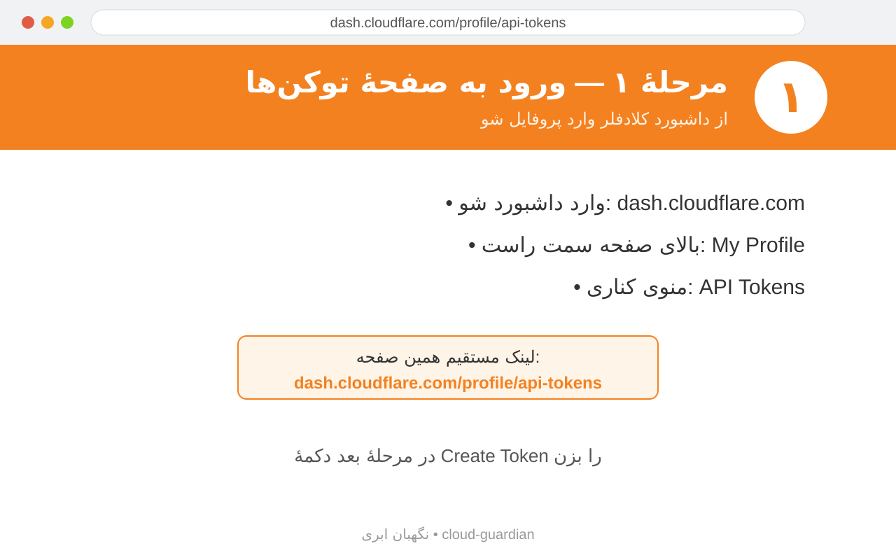
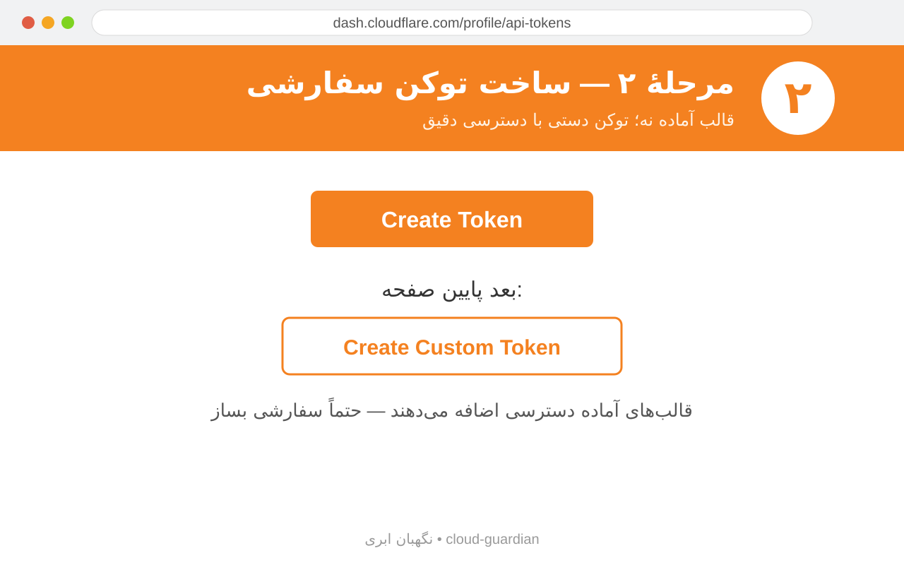
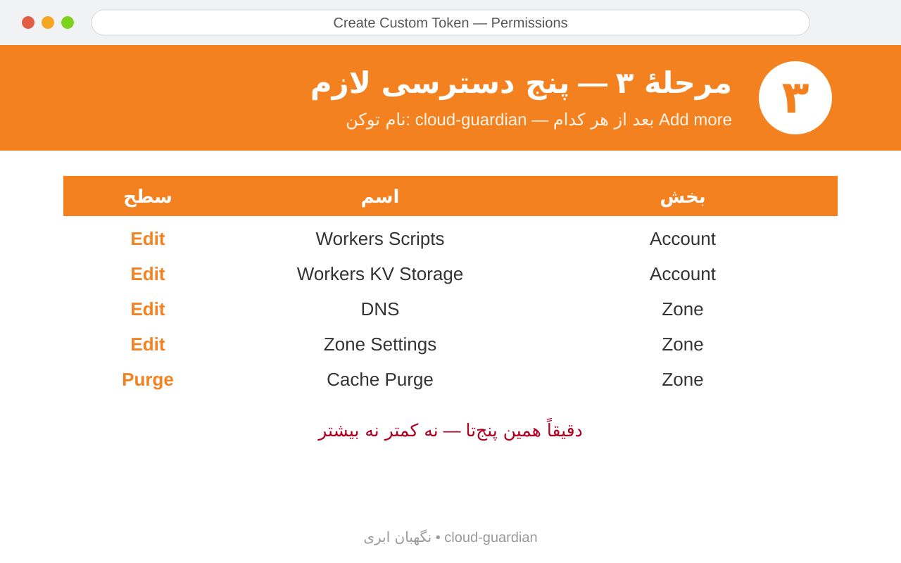
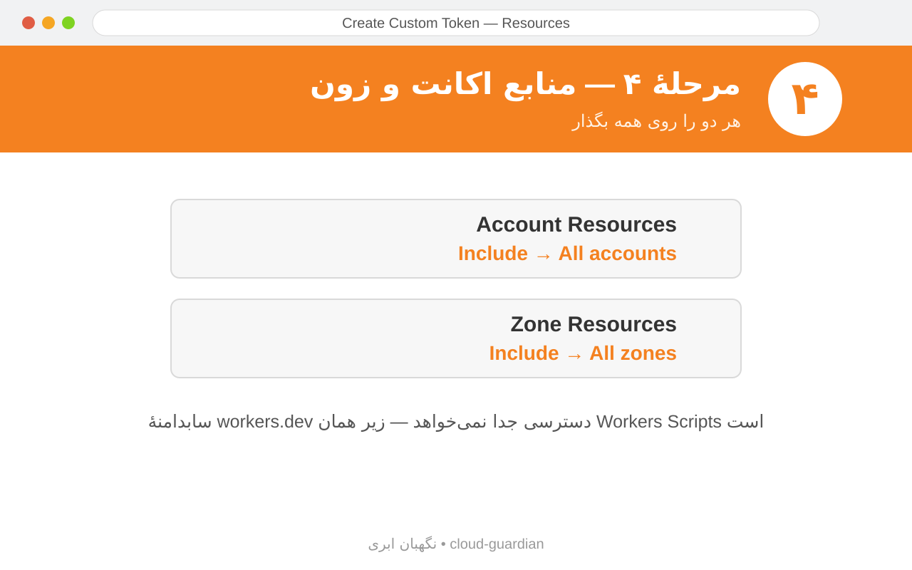
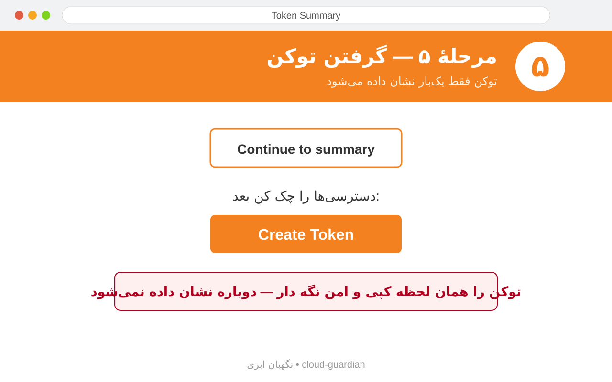
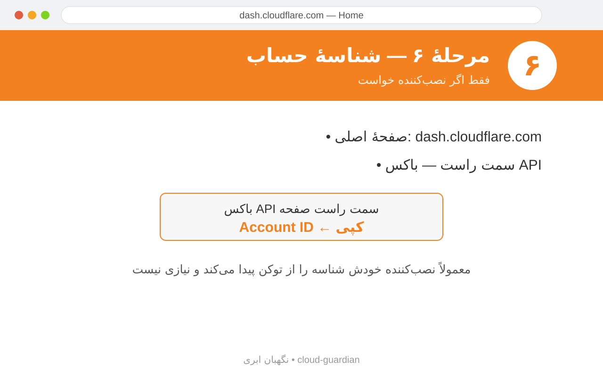

# آموزش تصویری: ساخت توکن API کلادفلر 🎬

این آموزش، گامبهگام ساخت توکنی است که رباتِ «نگهبان ابری» برای مدیریت DNS و دیپلوی روی ورکر به آن نیاز دارد.

> 🔗 **لینک مستقیم ساخت توکن:** https://dash.cloudflare.com/profile/api-tokens

> عکس هر مرحله زیر همان مرحله آمده است (پوشهٔ `docs/images/`). اگر از داشبورد خودتان اسکرین‌شات گرفتید، با همین نام‌ها جایگزین کنید.

---

## مرحلهٔ ۱ — ورود به صفحهٔ توکنها

1. وارد داشبورد کلادفلر شوید: `https://dash.cloudflare.com`
2. از منوی بالای سمت راست روی **My Profile** کلیک کنید.
3. از منوی کناری **API Tokens** را بزنید — یا مستقیم: https://dash.cloudflare.com/profile/api-tokens



---

## مرحلهٔ ۲ — ساخت توکن سفارشی

1. روی دکمهٔ **Create Token** کلیک کنید.
2. در پایین صفحه گزینهٔ **Create Custom Token** را بزنید.



---

## مرحلهٔ ۳ — تنظیم دسترسیها (مهمترین قسمت)

1. یک نام بگذارید، مثلاً `cloud-guardian`.
2. این پنج دسترسی را اضافه کنید (روی **Add more** بعد از هر کدام):

| بخش | اسم | سطح | برای چه کاری در ربات |
|---|---|---|---|
| Account | Workers Scripts | Edit | دیپلوی، آپدیت خودکار ورکر و سابدامنهٔ `workers.dev` |
| Account | Workers KV Storage | Edit | ساخت KV ربات |
| Zone | DNS | Edit | مدیریت رکوردها و ساخت سابدامنهٔ رله |
| Zone | Zone Settings | Edit | مشاهده/تغییر تنظیمات هر زون (TLS/کش/…) |
| Zone | Cache Purge | Purge | دکمهٔ «پاککردن کش» زون |



> ⚠️ کار با سابدامنهٔ `workers.dev` جداگانه نیست؛ زیرمجموعهٔ دسترسی **Account → Workers Scripts → Edit** است و در فهرست پنل ابری به این اسم دیده نمیشود.
> ⚠️ این پنج دسترسی، **دقیقاً** همانهایی هستند که ربات استفاده میکند.

3. بخش **Account Resources** را روی **Include → All accounts** بگذارید.
4. بخش **Zone Resources** را روی **Include → All zones** بگذارید.



---

## مرحلهٔ ۴ — گرفتن توکن

1. روی **Continue to summary** کلیک کنید.
2. دسترسیها را چک کنید و **Create Token** را بزنید.
3. توکن فقط **یکبار** نمایش داده میشود؛ آن را کپی و امن نگه دارید.



> ⚠️ توکن را به هیچکس ندهید و داخل ریپو/فایل عمومی نگذارید. فقط در همان ربات یا فایل `~/.cloud-guardian/config.json` (روی سرور خودتان) باشد.

---

## مرحلهٔ ۵ — شناسهٔ حساب (Account ID)

اگر نصبکننده «Account ID» خواست:

1. صفحهٔ اصلی `dash.cloudflare.com`.
2. سمت راست — باکس **API** — رشتهٔ `Account ID` را کپی کنید.



> در بیشتر موارد نصبکننده بهصورت خودکار شناسه را از خود توکن پیدا میکند و نیازی به وارد کردن نیست.

---

## آزمون سریع

اگر میخواهید بدانید توکن سالم است، در ترمینال سرور:

```bash
curl -s -H "Authorization: Bearer توکن_شما" "https://api.cloudflare.com/client/v4/user/tokens/verify"
```

خروجی باید شامل `"success": true` باشد.